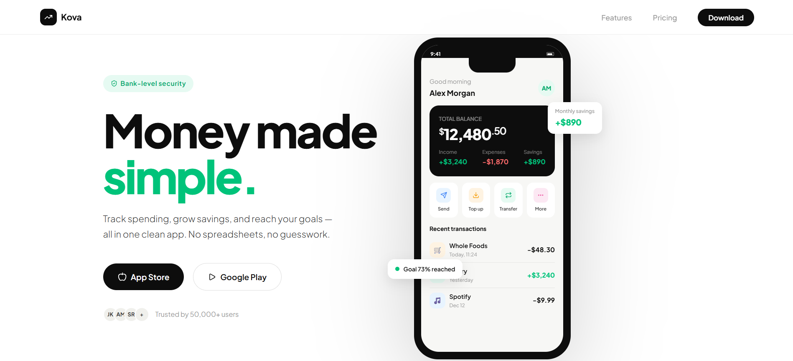

# Kova — Mobile App Landing Page

A responsive landing page for a fictional personal finance mobile app. Built as a portfolio project demonstrating CSS phone mockup techniques, modern layout patterns, and conversion-focused design.

**[Live Demo →](https://akim-dev3.github.io/kova-landing)**



---

## Overview

Kova is a concept fintech app for personal budgeting. The landing page is structured around driving app downloads — hero with phone mockup, feature showcase, pricing, and social proof.

---

## Features

- Fully responsive — mobile, tablet, desktop
- Pure CSS phone mockup with realistic UI inside
- Floating stat pills on the phone mockup
- Scroll-reveal animations (IntersectionObserver)
- Fixed navbar with backdrop blur
- Mini bar chart built in pure CSS
- Pricing grid with featured card
- Zero dependencies — pure HTML, CSS, JavaScript

---

## Tech Stack

| Layer | Technology |
|---|---|
| Markup | HTML5 (semantic) |
| Styling | CSS3 (custom properties, Grid, Flexbox) |
| Icons | Lucide Icons (SVG, via CDN) |
| Fonts | Google Fonts (Plus Jakarta Sans) |
| Behaviour | Vanilla JavaScript |
| Deploy | GitHub Pages |

---

## Project Structure

```
kova-landing/
├── index.html        — full page (single file)
├── README.md
└── preview.png       — screenshot for README
```

---

## Local Development

```bash
open index.html
# or
python3 -m http.server 3000
```

---

## Sections

1. **Navbar** — fixed, blur, download CTA
2. **Hero** — headline, dual CTA, CSS phone mockup with live UI
3. **Brand bar** — press mentions
4. **Features** — 5-card asymmetric grid, dark hero card with chart
5. **Stats** — 4 key numbers
6. **How it works** — 3-step process
7. **Pricing** — 3 tiers, featured dark card
8. **Testimonials** — 3 user reviews
9. **CTA** — dark block with app store buttons
10. **Footer**

---

## License

MIT — free to use and adapt.
